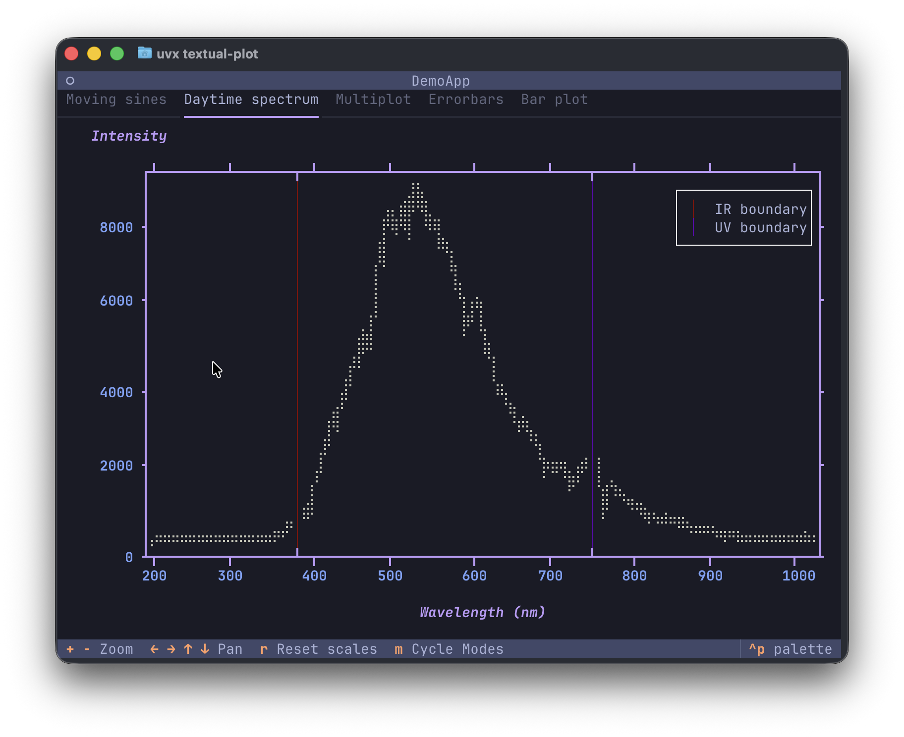
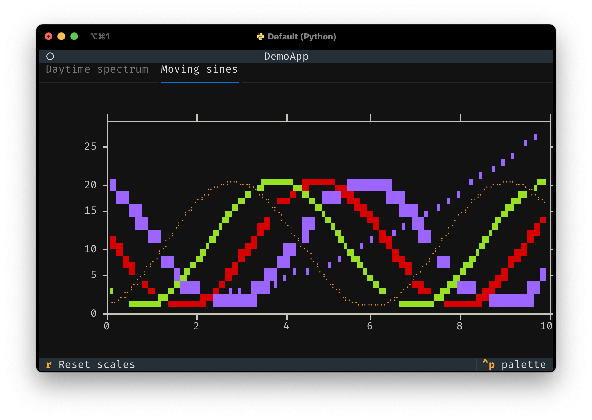

# A native plotting widget for Textual apps

[Textual](https://www.textualize.io/) is an excellent Python framework for building applications in the terminal, or on the web. This library provides a plot widget which your app can use to plot all kinds of quantitative data. So, no pie charts, sorry. The widget support scatter plots and line plots, and can also draw using _high-resolution_ characters like unicode half blocks, quadrants and 8-dot Braille characters. It may still be apparent that these are drawn using characters that take up a full block in the terminal, especially when plot series overlap. However, the use of these characters can reduce the line thickness and improve the resolution tremendously.

## Screenshots





## Running the demo / installation

If you have [uv](https://astral.sh/uv/) installed, run
```console
uvx textual-plot
```
If you use pipx, replace `uvx` with `pipx`. Alternatively, install the package with `pip` and run the demo:
```console
pip install textual-plot
python -m textual_plot.demo
```

## Tutorial
