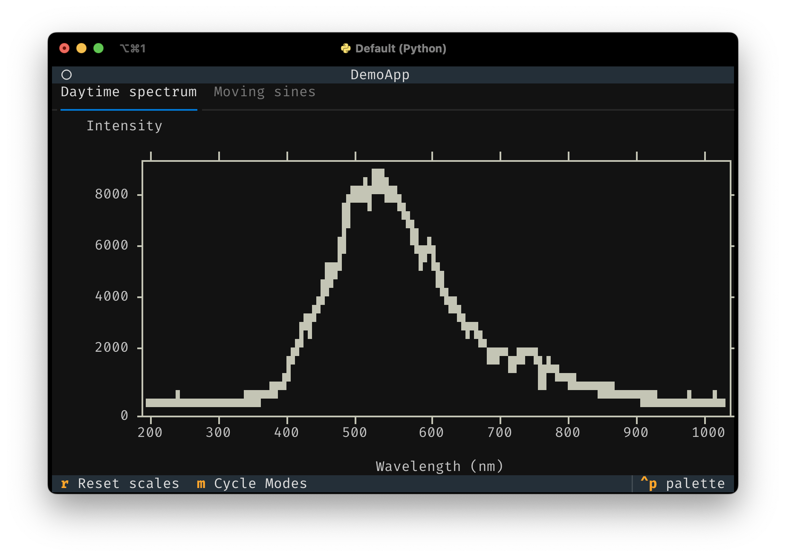

# A native plotting widget for Textual apps

[Textual](https://www.textualize.io/) is an excellent Python framework for building applications in the terminal, or on the web. This library provides a plot widget which your app can use to plot all kinds of quantitative data. So, no pie charts, sorry. The widget support scatter plots and line plots, and can also draw using _high-resolution_ characters like unicode half blocks, quadrants and 8-dot Braille characters. It may still be apparent that these are drawn using characters that take up a full block in the terminal, especially when plot series overlap. However, the use of these characters can reduce the line thickness and improve the resolution tremendously.

## Screenshots




## Running the demo / installation

If you have [uv](https://astral.sh/uv/) installed, run
```console
uvx textual-plot
```
If you use pipx, replace `uvx` with `pipx`. Alternatively, install the package with `pip` and run the demo:
```console
pip install textual-plot
python -m textual_plot.demo
```

## Tutorial

A minimal examples is shown below:

```python
from textual.app import App, ComposeResult

from textual_plot import PlotWidget


class MinimalApp(App[None]):
    def compose(self) -> ComposeResult:
        yield PlotWidget()

    def on_mount(self) -> None:
        plot = self.query_one(PlotWidget)
        plot.plot(x=[0, 1, 2, 3, 4], y=[0, 1, 4, 9, 16])


MinimalApp().run()
```
The code is quite simple. You simply include a `PlotWidget` in your compose method and after your UI has finished composing, you can start plotting data. The `plot()` method takes `x` and `y` data which should be array-like. It can be lists, or NumPy arrays, or really anything that can be turned into a NumPy array which is what's used internally. The `plot()` method further accepts a `line_style` argument which accepts Textual styles like `"white"`, `"red on blue3"`, etc. For standard low-resolution plots, it does not make much sense to specify a background color since the text character used for plotting is a full block filling an entire cell. The plot widget supports high-resolution plotting where the character does not take up the full cell:


```python
from textual.app import App, ComposeResult

from textual_plot import HiResMode, PlotWidget


class MinimalApp(App[None]):
    def compose(self) -> ComposeResult:
        yield PlotWidget()

    def on_mount(self) -> None:
        plot = self.query_one(PlotWidget)
        plot.plot(
            x=[0, 1, 2, 3, 4],
            y=[0, 1, 4, 9, 16],
            hires_mode=HiResMode.BRAILLE,
            line_style="bright_yellow on blue3",
        )


MinimalApp().run()
```
Admittedly, you'll be mostly plotting with foreground colors only. The plot widget supports four high-resolution modes: `Hires.BRAILLE` (2x8), `HiRes.HALFBLOCK` (1x2) and `HiRes.QUADRANT` (2x2) where the size between brackets is the number of 'pixels' inside a single cell.

To create scatter plots, use the `scatter()` method, which accepts a `marker` argument which can be any unicode character (as long as it is one cell wide, which excludes many emoji characters and non-Western scripts):

```python
import numpy as np
from textual.app import App, ComposeResult

from textual_plot import PlotWidget


class MinimalApp(App[None]):
    def compose(self) -> ComposeResult:
        yield PlotWidget()

    def on_mount(self) -> None:
        rng = np.random.default_rng(seed=4)
        plot = self.query_one(PlotWidget)

        x = np.linspace(0, 10, 21)
        y = 0.2 * x - 1 + rng.normal(loc=0.0, scale=0.2, size=len(x))
        plot.scatter(x, y, marker="⦿")


MinimalApp().run()
```